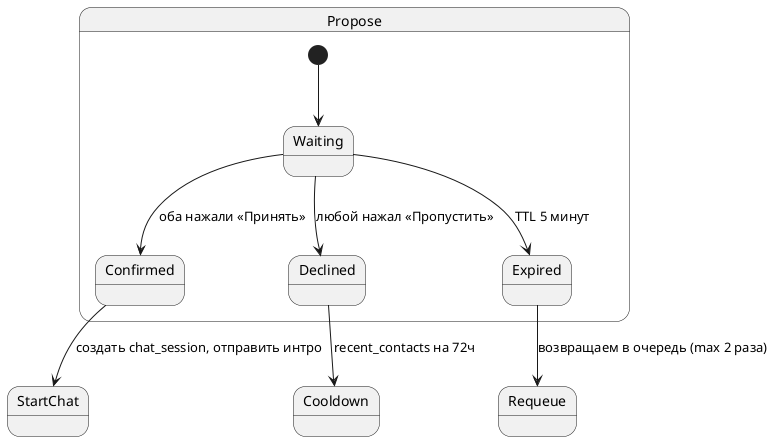

## Sprint 2 — Матчинг 1‑на‑1 (переписано)

**Цель:** пользователь с валидным профилем нажимает «Найти собеседника» и получает **предложение матча ≤ 60 сек**; при взаимном согласии создаётся чат‑сессия с интро и правилами.

**Definition of Ready:** профиль содержит ≥2 темы, подтверждены правила.
**Definition of Done:** e2e‑путь работает на стейдже (EU), метрики и алерты в Grafana, интеграционные тесты зелёные.

### 1) Архитектурный зум (MVP)

* Транспорт: Telegram Bot Webhook → FastAPI `/telegram/webhook`.
* Очередь: Redis Streams `match.find` (producer — API, consumer — `workers/match_worker`).
* Хранилище: PostgreSQL (`users`, `topics`, `user_topics`, `matches`, `chat_sessions`, `recent_contacts`).
* Связь с ботом: aiogram 3.x, inline‑кнопки «Принять/Пропустить».

```plantuml
@startuml
actor User
participant Bot
participant API
queue "Redis Streams
match.find" as R
Database "PostgreSQL" as DB

User -> Bot: /find
Bot -> API: POST /match/find
API -> R: XADD match.find {user_id, topics, tz}
R -> API: XREADGROUP (matchers)
API -> DB: SELECT кандидаты (≥2 темы, фильтры)
API -> Bot: отправка предложений обоим
User -> Bot: Accept / Decline (inline)
Bot -> API: POST /match/confirm
API -> DB: create Match + ChatSession
Bot -> User: интро и правила
@enduml
```

### 2) Данные и миграции

**Новая таблица:**

```sql
CREATE TABLE IF NOT EXISTS recent_contacts (
  user_id  BIGINT NOT NULL,
  other_id BIGINT NOT NULL,
  until    TIMESTAMPTZ NOT NULL,
  PRIMARY KEY (user_id, other_id)
);
CREATE INDEX IF NOT EXISTS idx_user_topics_topic ON user_topics(topic_id);
```

**SQLAlchemy (фрагмент):**

```python
class RecentContact(Base):
    __tablename__ = "recent_contacts"
    user_id: Mapped[int] = mapped_column(BigInteger, primary_key=True)
    other_id: Mapped[int] = mapped_column(BigInteger, primary_key=True)
    until: Mapped[datetime] = mapped_column(DateTime(timezone=True))
```

### 3) Контракты API (черновик)

```http
POST /match/find
Auth: internal (из бота) | user context
200 { "queued": true }

POST /match/confirm
Body: { "match_id": number, "action": "accept" | "decline" }
200 { "status": "active" | "declined" | "expired" }
```

### 4) Хэндлеры бота (aiogram 3.x)

**/find → запрос на матчинг:**

```python
@router.message(Command("find"))
async def find_handler(msg: Message, api: ApiClient, repo: Repo):
    user = await repo.get_user_by_tg(msg.from_user.id)
    if not user or user.topic_count < 2:
        return await msg.answer("Добавьте минимум 2 темы в профиле: /profile")
    await api.post("/match/find", json={"user_id": user.id})
    await msg.answer("Ищу вам собеседника… Это может занять до минуты.")
```

**Inline‑кнопки предложения:**

```python
def propose_kb(mid: int):
    return InlineKeyboardMarkup(inline_keyboard=[[
        InlineKeyboardButton(text="✅ Принять", callback_data=f"match:accept:{mid}"),
        InlineKeyboardButton(text="➖ Пропустить", callback_data=f"match:decline:{mid}")
    ]])

@router.callback_query(F.data.startswith("match:"))
async def on_match_action(cb: CallbackQuery, api: ApiClient):
    _kind, action, mid = cb.data.split(":", 2)
    res = await api.post("/match/confirm", json={"match_id": int(mid), "action": action})
    if res["status"] == "active":
        await cb.message.edit_text("Совпадение! Открыл чат и отправил правила.")
    else:
        await cb.message.edit_text("Ок, пропускаем. Продолжаю поиск.")
```

### 5) Очередь матчей — Redis Streams

**Константы:** `STREAM=find.match`, `GROUP=matchers`, `DEAD=match.dead`.

**Producer (`POST /match/find`):**

```python
payload = {"user_id": str(u.id), "topics": ",".join(map(str,u.topics)),
           "tz": u.tz, "requested_at": str(int(time.time()*1000))}
await redis.xadd("match.find", payload, maxlen=10000, approximate=True)
```

**Consumer (`workers/match_worker.py`):**

```python
async def loop(redis, db):
    await ensure_group(redis)
    while True:
        resp = await redis.xreadgroup("matchers", "w1", {"match.find": ">"}, count=16, block=5000)
        if not resp: continue
        for _stream, msgs in resp:
            for msg_id, fields in msgs:
                try:
                    await handle_match(fields, db)
                    await redis.xack("match.find", "matchers", msg_id)
                except Exception:
                    await redis.xadd("match.dead", {"orig": msg_id, **fields})
```

### 6) Подбор кандидатов и скоринг

**SQL (ядро ≥2 общих темы):**

```sql
WITH me AS (
  SELECT :user_id AS user_id,
         ARRAY(SELECT topic_id FROM user_topics WHERE user_id = :user_id) AS my_topics,
         (SELECT tz FROM users WHERE id = :user_id) AS my_tz
), pool AS (
  SELECT u.id AS cand_id, u.tz,
         ARRAY(SELECT topic_id FROM user_topics ut WHERE ut.user_id = u.id) AS cand_topics
  FROM users u
  WHERE u.id <> :user_id
    AND NOT EXISTS (
      SELECT 1 FROM recent_contacts rc
      WHERE rc.user_id = :user_id AND rc.other_id = u.id AND rc.until > now()
    )
), overlap AS (
  SELECT p.cand_id,
         CARDINALITY(ARRAY(SELECT UNNEST(p.cand_topics) INTERSECT SELECT UNNEST(me.my_topics))) AS shared_cnt,
         p.tz
  FROM pool p, me
)
SELECT cand_id, shared_cnt
FROM overlap
WHERE shared_cnt >= 2
ORDER BY shared_cnt DESC
LIMIT 10;
```

**Скоринг (Python):**

```python
def score(shared_cnt: int, time_overlap: float, helpfulness: float = 0.5) -> float:
    return 0.6*min(shared_cnt/5,1.0) + 0.2*time_overlap + 0.2*helpfulness
```

### 7) Машина состояний (предложение/подтверждение)



### 8) Метрики и алерты (Prometheus)

* `match_queue_size`, `match_worker_lag_ms`, `proposals_sent_total`, `proposal_ttl_expired_total`
* `match_accept_total`, `match_decline_total`, `accept_rate`
* `sql_match_select_ms_bucket|sum|count`

Алерты: лаг очереди > 5 мин; `accept_rate < 0.25` (за 60 мин).

### 9) Интеграционные тесты (pytest)

**Сценарий e2e:**

1. Создать 2 тест‑пользователей с ≥2 общими темами.
2. Оба отправляют `/find` → появляется событие в `match.find`.
3. Консюмер шлёт предложения обоим.
4. Оба жмут «Принять» → `matches.status=active`, создаётся `chat_sessions`.
5. Проверить, что бот отправил интро и правила двум участникам.

### 10) Критерии приёмки Sprint 2

* ≥70% запросов `/find` получают предложение ≤ 60 сек на стейдже (≈2 RPS).
* `accept_rate` ≥ 30% на тестовых данных.
* Все интеграционные тесты зелёные, алерты заведены и не срабатывают в нормальном режиме.
